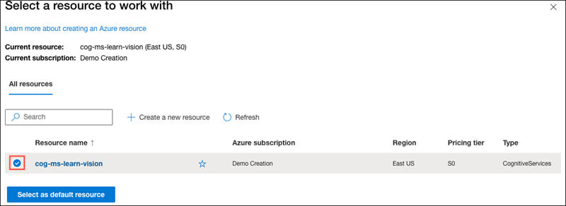

# Vision Studio

O [Vision Studio](https://portal.vision.cognitive.azure.com/) é um conjunto de ferramentas baseadas em interface do usuário que permite explorar, compilar e integrar recursos da Visão de IA do Azure.

O Vision Studio permite que você experimente vários recursos de serviço e obtenha amostras dos dados retornados de maneira rápida e direta. Usando o Vision Studio, é possível começar a experimentar os serviços e saber o que eles oferecem sem precisar escrever nenhum código. Em seguida, use as bibliotecas de cliente disponíveis e as APIs REST para começar a inserir esses serviços em seus aplicativos.

## Detectar rostos no Vision Studio

As soluções de visão geralmente exigem que a IA seja capaz de detectar rostos humanos. Suponha que a empresa varejista fictícia Northwind Traders queira localizar onde os clientes estão em uma loja para melhor atendê-los. Uma maneira de fazer isso é determinar se há algum rosto nas imagens e, em caso afirmativo, retornar as coordenadas da caixa delimitadora que mostram sua localização.

Para testar as capacidades de deteção facial do serviço Azure AI Face, utilizará [o Azure Vision Studio](https://portal.vision.cognitive.azure.com/) . Esta é uma plataforma baseada em UI que permite explorar os recursos do Azure AI Vision sem a necessidade de escrever nenhum código.

Crie um recurso *de serviços de IA do Azure*

Você pode usar o serviço Azure AI Face com um recurso multisserviço de **serviços de IA do Azure** . Se ainda não o fez, crie um recurso **de serviços de IA do Azure** na sua assinatura do Azure.

1. Em outra guia do navegador, abra o portal do Azure em [https://portal.azure.com](https://portal.azure.com/?azure-portal=true) , entrando com a conta da Microsoft associada à sua assinatura do Azure.
1. Clique no botão **＋Criar um recurso** e pesquise os *serviços de IA do Azure* . Selecione **criar** um plano **de serviços de IA do Azure** . Você será levado a uma página para criar um recurso de serviços de IA do Azure. Configure-o com as seguintes configurações:
   1. **Assinatura** : *sua assinatura do Azure* .
   1. **Grupo de recursos** : *selecione ou crie um grupo de recursos com um nome exclusivo* .
   1. **Região** : Leste dos EUA.
   1. **Nome** : *Insira um nome exclusivo* .
   1. **Nível de preços** : *Padrão S0.*
   1. **Ao marcar esta caixa, confirmo que li e compreendi todos os termos abaixo** : *Selecionado* .
1. Selecione **Revisar + criar** e depois **Criar** e aguarde a conclusão da implantação.

Conecte seu recurso de serviço de IA do Azure ao Vision Studio

Em seguida, conecte o recurso de serviços de IA do Azure provisionado acima ao Vision Studio.

1. Em outra guia do navegador, navegue até **Vision Studio** em [https://portal.vision.cognitive.azure.com](https://portal.vision.cognitive.azure.com/?azure-portal=true) .
1. Entre com sua conta e certifique-se de usar o mesmo diretório onde você criou seu recurso de serviços de IA do Azure.
1. Na página inicial do Vision Studio, selecione **Visualizar todos os recursos** no título **Introdução ao Vision** .

   

1. Na página **Selecione um recurso para trabalhar** , passe o cursor do mouse sobre o recurso que você criou acima na lista e marque a caixa à esquerda do nome do recurso e selecione **Selecionar como recurso padrão** .

**Nota** : Se o seu recurso não estiver listado, pode ser necessário **atualizar** a página.

1. Feche a página de configurações selecionando o “x” no canto superior direito da tela.

Detecte rostos no Vision Studio

1. Num navegador web, navegue até **Vision Studio** em [https://portal.vision.cognitive.azure.com](https://portal.vision.cognitive.azure.com/?azure-portal=true) .
1. Na página **inicial Introdução ao Vision** , selecione a guia **Face** e, em seguida, selecione o bloco **Detectar rostos em uma imagem** .
1. No subtítulo **Experimente** , reconheça a política de uso de recursos lendo e marcando a caixa.
1. Selecione cada uma das imagens de amostra e observe os dados de detecção facial retornados.
1. Agora vamos tentar com algumas de nossas próprias imagens. Selecione [**https://aka.ms/mslearn-detect-faces**](https://aka.ms/mslearn-detect-faces) para baixar **detect-faces.zip** . Em seguida, abra a pasta no seu computador.
1. Localize o arquivo chamado **store-camera-1.jpg** ; que contém a seguinte imagem:

   

1. Faça upload de **store-camera-1.jpg** e revise os detalhes de detecção de rosto retornados.
1. Localize o arquivo chamado **store-camera-2.jpg** ; que contém a seguinte imagem:

   

1. Faça upload de **store-camera-2.jpg** e revise os detalhes de detecção de rosto retornados.
1. Localize o arquivo chamado **store-camera-3.jpg** ; que contém a seguinte imagem:

   

1. Faça upload de **store-camera-3.jpg** e revise os detalhes de detecção de rosto retornados. Observe como o Azure AI Face não detectou o rosto que está obscurecido.

Neste exercício você explorou como os serviços de IA do Azure podem detectar rostos em imagens. Se você tiver tempo, sinta-se à vontade para experimentar as imagens de exemplo ou algumas de suas próprias imagens.

Limpar

Se não pretende fazer mais exercícios, exclua todos os recursos que não precisa mais. Isso evita acumular custos desnecessários.

1. Abra o **portal do Azure** em [https://portal.azure.com](https://portal.azure.com/?azure-portal=true) e selecione o grupo de recursos que contém o recurso que você criou.
1. Selecione o recurso e selecione **Excluir** e depois **Sim** para confirmar. O recurso é então excluído.

## Ler texto no Vision Studio

Neste exercício, você usará o serviço Azure AI para explorar os recursos de reconhecimento óptico de caracteres do Azure AI Vision. Você usará o Vision Studio para experimentar a extração de texto de imagens, sem precisar escrever nenhum código.

Um desafio comum da visão computacional é detectar e interpretar texto incorporado em uma imagem. Isso é conhecido como reconhecimento óptico de caracteres (OCR). Neste exercício você usará um recurso de serviços de IA do Azure, que inclui serviços do Azure AI Vision. Em seguida, você usará o Vision Studio para testar o OCR com diferentes tipos de imagens.

Crie um recurso *de serviços de IA do Azure*

Você pode usar os recursos de OCR do Azure AI Vision com um recurso multisserviço **de serviços de IA do Azure** . Se ainda não o fez, crie um recurso **de serviços de IA do Azure** na sua assinatura do Azure.

1. Em outra guia do navegador, abra o **portal do Azure** em [https://portal.azure.com](https://portal.azure.com/?azure-portal=true) , entrando com a conta da Microsoft associada à sua assinatura do Azure.
1. Clique no botão **＋Criar um recurso** e pesquise os *serviços de IA do Azure* . Selecione **criar** um plano **de serviços de IA do Azure** . Você será levado a uma página para criar um recurso de serviços de IA do Azure. Configure-o com as seguintes configurações:
   1. **Assinatura** : *sua assinatura do Azure* .
   1. **Grupo de recursos** : *selecione ou crie um grupo de recursos com um nome exclusivo* .
   1. **Região** : Leste dos EUA.
   1. **Nome** : *Insira um nome exclusivo* .
   1. **Nível de preços** : *Padrão S0.*
   1. **Ao marcar esta caixa, confirmo que li e compreendi todos os termos abaixo** : *Selecionado* .
1. Selecione **Revisar + criar** e depois **Criar** e aguarde a conclusão da implantação.

Conecte seu recurso de serviço de IA do Azure ao Vision Studio

Em seguida, conecte o recurso de serviços de IA do Azure provisionado acima ao Vision Studio.

1. Em outra guia do navegador, navegue até **Vision Studio** em [https://portal.vision.cognitive.azure.com](https://portal.vision.cognitive.azure.com/?azure-portal=true) .
1. Entre com sua conta e certifique-se de usar o mesmo diretório onde você criou seu recurso de serviços de IA do Azure.
1. Na página inicial do Vision Studio, selecione **Visualizar todos os recursos** no título **Introdução ao Vision** .

   

1. Na página **Selecione um recurso para trabalhar** , passe o cursor do mouse sobre o recurso que você criou acima na lista e marque a caixa à esquerda do nome do recurso e selecione **Selecionar como recurso padrão** .

**Nota** : Se o seu recurso não estiver listado, pode ser necessário **atualizar** a página.

1. Feche a página de configurações selecionando o “x” no canto superior direito da tela.

Extraia texto de imagens no Vision Studio

1. Num navegador web, navegue até **Vision Studio** em [https://portal.vision.cognitive.azure.com](https://portal.vision.cognitive.azure.com/?azure-portal=true) .
1. Na página **inicial Introdução ao Vision** , selecione **Reconhecimento óptico de caracteres** e, em seguida, o bloco **Extrair texto de imagens** .
1. No subtítulo **Experimente** , reconheça a política de uso de recursos lendo e marcando a caixa.
1. Selecione [**https://aka.ms/mslearn-ocr-images**](https://aka.ms/mslearn-ocr-images) para baixar **ocr-images.zip** . Em seguida, abra a pasta.
1. No portal, selecione **Procurar um arquivo** e navegue até a pasta em seu computador onde você baixou **ocr-images.zip** . Selecione **advert.jpg** e selecione **Abrir** .
1. Agora revise o que é retornado:
   1. Nos **atributos detectados** , qualquer texto encontrado na imagem é organizado em uma estrutura hierárquica de regiões, linhas e palavras.
   1. Na imagem, a localização do texto é indicada por uma caixa delimitadora, conforme mostrado aqui:

   

1. Agora você pode tentar outra imagem. Selecione **Procurar um arquivo** e navegue até a pasta onde você salvou os arquivos do GitHub. Selecione **carta.jpg** .

   

1. Revise os resultados da segunda imagem. Deve retornar o texto e as caixas delimitadoras do texto. Se você tiver tempo, tente **note.jpg** e **recibo.jpg** .

   

   

Limpar

Se não pretende fazer mais exercícios, exclua todos os recursos que não precisa mais. Isso evita acumular custos desnecessários.

1. Abra o **portal do Azure** em [https://portal.azure.com](https://portal.azure.com/?azure-portal=true) e selecione o grupo de recursos que contém o recurso que você criou.
1. Selecione o recurso e selecione **Excluir** e depois **Sim** para confirmar. O recurso é então excluído.

## Analise imagens no Vision Studio

**O Azure AI Vision** inclui inúmeras capacidades para compreender o conteúdo e o contexto da imagem e extrair informações das imagens. O Azure AI Vision Studio permite-lhe experimentar muitas das capacidades de análise de imagens.

Neste exercício, você usará o Vision Studio para analisar imagens usando as experiências de teste integradas. Suponhamos que o retalhista fictício *Northwind Traders* tenha decidido implementar uma “loja inteligente”, na qual os serviços de IA monitorizam a loja para identificar os clientes que necessitam de assistência e direcionam os funcionários para os ajudar. Ao utilizar o Azure AI Vision, as imagens captadas por câmaras em toda a loja podem ser analisadas para fornecer descrições significativas do que representam.

Crie um recurso *de serviços de IA do Azure*

Você pode usar os recursos de análise de imagem do Azure AI Vision com um recurso multisserviço **de serviços de IA do Azure** . Se ainda não o fez, crie um recurso **de serviços de IA do Azure** na sua assinatura do Azure.

1. Em outra guia do navegador, abra o portal do Azure em [https://portal.azure.com](https://portal.azure.com/?azure-portal=true) , entrando com a conta da Microsoft associada à sua assinatura do Azure.
1. Clique no botão **＋Criar um recurso** e pesquise os *serviços de IA do Azure* . Selecione **criar** um plano **de serviços de IA do Azure** . Você será levado a uma página para criar um recurso de serviços de IA do Azure. Configure-o com as seguintes configurações:
   1. **Assinatura** : *sua assinatura do Azure* .
   1. **Grupo de recursos** : *selecione ou crie um grupo de recursos com um nome exclusivo* .
   1. **Região** : Leste dos EUA.
   1. **Nome** : *Insira um nome exclusivo* .
   1. **Nível de preços** : *Padrão S0.*
   1. **Ao marcar esta caixa, confirmo que li e compreendi todos os termos abaixo** : *Selecionado* .
1. Selecione **Revisar + criar** e depois **Criar** e aguarde a conclusão da implantação.

Conecte seu recurso de serviço de IA do Azure ao Vision Studio

Em seguida, conecte o recurso de serviço Azure AI provisionado acima ao Vision Studio.

1. Em outra guia do navegador, navegue até [Vision Studio](https://portal.vision.cognitive.azure.com/?azure-portal=true) .
1. Entre com sua conta e certifique-se de usar o mesmo diretório onde você criou seu recurso de serviços de IA do Azure.
1. Na página inicial do Vision Studio, selecione **Visualizar todos os recursos** no título **Introdução ao Vision** .

   

1. Na página **Selecione um recurso para trabalhar** , passe o cursor do mouse sobre o recurso que você criou acima na lista e marque a caixa à esquerda do nome do recurso e selecione **Selecionar como recurso padrão** .

**Nota** : Se o seu recurso não estiver listado, pode ser necessário **atualizar** a página.

1. Feche a página de configurações selecionando o “x” no canto superior direito da tela.

Gerar legendas para uma imagem

Agora você está pronto para usar o Vision Studio para analisar imagens tiradas por uma câmera na loja *Northwind Traders .*

Vejamos a funcionalidade de legenda de imagens do Azure AI Vision. As legendas das imagens estão disponíveis por meio dos recursos **Legenda** e **Legendas densas** .

1. Em um navegador da web, navegue até [Vision Studio](https://portal.vision.cognitive.azure.com/?azure-portal=true) .
1. Na página **inicial Introdução ao Vision** , selecione a guia **Análise de imagem** e, em seguida, selecione o bloco **Adicionar legendas às imagens** .

   
1. No subtítulo **Experimente** , reconheça a política de uso de recursos lendo e marcando a caixa.
1. Selecione [**https://aka.ms/mslearn-images-for-análise**](https://aka.ms/mslearn-images-for-analysis) para baixar **image-análise.zip** . Abra a pasta no seu computador e localize o arquivo chamado **store-camera-1.jpg** ; que contém a seguinte imagem:

   

1. Carregue a imagem **store-camera-1.jpg** arrastando-a para a caixa **Arrastar e soltar arquivos aqui** ou navegando até ela em seu sistema de arquivos.
1. Observe o texto da legenda gerado, visível no painel **Atributos detectados** à direita da imagem.

   A funcionalidade **Caption** fornece uma única frase em inglês legível que descreve o conteúdo da imagem.

1. Em seguida, use a mesma imagem para realizar **legendas densas** . Retorne à página inicial **do Vision Studio** e, como fez antes, selecione a guia **Análise de imagem** e, em seguida, selecione o bloco **Legenda densa** .

   O recurso **Dense Captions** difere do recurso **Caption** porque fornece diversas legendas legíveis para uma imagem, uma descrevendo o conteúdo da imagem e outras, cada uma cobrindo os objetos essenciais detectados na imagem. Cada objeto detectado inclui uma caixa delimitadora, que define as coordenadas dos pixels na imagem associada ao objeto.

1. Passe o mouse sobre uma das legendas na lista de atributos **detectados** e observe o que acontece na imagem.

   

   Mova o cursor do mouse sobre as outras legendas da lista e observe como a caixa delimitadora muda na imagem para destacar a parte da imagem usada para gerar a legenda.

Marcando imagens

O próximo recurso que você experimentará é a funcionalidade **Extrair Tags** . Extrair tags é baseado em milhares de objetos reconhecíveis, incluindo seres vivos, cenários e ações.

1. Retorne à página inicial do Vision Studio e selecione o bloco **Extrair tags comuns de imagens** na guia **Análise de imagem** .
1. Em **Escolha o modelo que deseja experimentar** , deixe selecionado **Produto pré-construído vs. modelo de lacuna** . Em **Escolha seu idioma** , selecione **Inglês** ou um idioma de sua preferência.
1. Abra a pasta que contém as imagens que você baixou e localize o arquivo chamado **store-image-2.jpg** , que se parece com isto:

   

1. Carregue o arquivo **store-camera-2.jpg** .
1. Revise a lista de tags extraídas da imagem e a pontuação de confiança de cada uma no painel de atributos detectados. Aqui, a pontuação de confiança é a probabilidade de o texto do atributo detectado descrever o que realmente está na imagem. Observe na lista de tags que ela inclui não apenas objetos, mas ações, como *compras* , *vendas* e *permanência* .

   
Detecção de objetos

Nesta tarefa, você usa o recurso **de detecção de objetos** da Análise de imagem. A detecção de objetos detecta e extrai caixas delimitadoras com base em milhares de objetos e seres vivos reconhecíveis.

1. Retorne à página inicial do Vision Studio e selecione o bloco **Detectar objetos comuns em imagens** na guia **Análise de imagem** .
1. Em **Escolha o modelo que deseja experimentar** , deixe selecionado **Produto pré-construído vs. modelo de lacuna** .
1. Abra a pasta que contém as imagens que você baixou e localize o arquivo chamado **store-camera-3.jpg** , que se parece com isto:

  

1. Carregue o arquivo **store-camera-3.jpg** .
1. Na caixa **Atributos detectados** , observe a lista de objetos detectados e suas pontuações de confiança.
1. Passe o cursor do mouse sobre os objetos na lista **Atributos detectados** para destacar a caixa delimitadora do objeto na imagem.
1. Mova o controle deslizante **Valor limite** até que um valor de 70 seja exibido à direita do controle deslizante. Observe o que acontece com os objetos da lista. O controle deslizante de limite especifica que somente objetos identificados com uma pontuação de confiança ou probabilidade maior que o limite devem ser exibidos.

Limpar

Se não pretende fazer mais exercícios, exclua todos os recursos que não precisa mais. Isso evita acumular custos desnecessários.

1. Abra o [portal do Azure](https://portal.azure.com/) e selecione o grupo de recursos que contém o recurso que você criou.
1. Selecione o recurso e selecione **Excluir** e depois **Sim** para confirmar. O recurso é então excluído.

[O link Visualizar todos os recursos está destacado em Introdução ao Vision no Vision Studio.]: Aspose.Words.9a9051df-9d45-4c02-b91d-7aeb9fdcccb6.001.png
[A caixa de diálogo Selecionar um recurso para trabalhar é exibida com o recurso de Serviços Cognitivos cog-ms-learn-vision-SUFFIX destacado e marcado. O botão Selecionar como recurso padrão está destacado.]: Aspose.Words.9a9051df-9d45-4c02-b91d-7aeb9fdcccb6.002.png
[Uma imagem de pessoas em uma loja.]: Aspose.Words.9a9051df-9d45-4c02-b91d-7aeb9fdcccb6.003.jpeg
